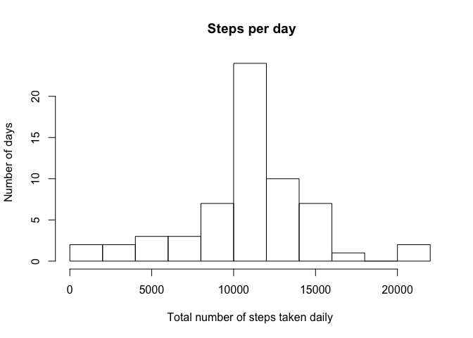

# Reproducible Research: Peer Assessment 1


## Loading and preprocessing the data

```r
unzip(zipfile="activity.zip")
data <- read.csv("activity.csv")
```


## What is mean total number of steps taken per day?
# 1. Total steps per day

```r
data.complete <- na.omit(data)
stepsperday <- tapply(data.complete$steps, data.complete$date, FUN=sum, na.rm=TRUE)
```
# 2. Histogram of total number of steps taken each day

```r
hist(stepsperday, main=" Steps per day", xlab="Total number of steps taken daily", ylab="Number of days", breaks=10)
```


# 3. Mean and Median of total number of steps

```r
mean(stepsperday, na.rm=TRUE)
```

```
## [1] 10766.19
```

```r
median(stepsperday, na.rm=TRUE)
```

```
## [1] 10765
```

## What is the average daily activity pattern?
# 1. Time Series Plot

```r
avgperint <- tapply(data.complete$steps, data.complete$interval, FUN=mean, na.rm=TRUE)

plot(names(avgperint),avgperint, type="l", main="Average daily activity", xlab="Interval", ylab="Average # of steps")
```


# 2. Finding the max number

```r
names(avgperint[which.max(avgperint)])
```

```
## [1] "835"
```


## Imputing missing values
# 1. Total number of missing values

```r
sum(is.na(data))
```

```
## [1] 2304
```
# 2. Missing values strategy
Replace all missing data with mean of that interval
# 3. New dataset with missing data filled in

```r
data.imputed<-data
for (i in which(is.na(data.imputed)))
{
data.imputed[i,1] <-avgperint[names(avgperint)==data.imputed$interval[i]]
}
```
# 4. Histogram of total bumber of steps taken each day + mean and median

```r
stepsperdayimpu <- tapply(data.imputed$steps, data.imputed$date, FUN=sum, na.rm=TRUE)

hist(stepsperdayimpu, main=" Steps per day", xlab="Total number of steps taken daily", ylab="Number of days", breaks=10)
```



```r
mean(stepsperdayimpu, na.rm=TRUE)
```

```
## [1] 10766.19
```

```r
median(stepsperdayimpu, na.rm=TRUE)
```

```
## [1] 10766.19
```
## Are there differences in activity patterns between weekdays and weekends?

```r
data.imputed$day <- ifelse (weekdays(as.Date(data.imputed$date)) %in% c("Saturday","Sunday"), "weekend", "weekday")

data.weekend <- data.imputed[data.imputed$day == "weekend", ]
data.weekday <- data.imputed[data.imputed$day == "weekday", ]

avgperintwnd <- tapply(data.weekend$steps, data.weekend$interval, FUN=mean, na.rm=TRUE)
avgperintwkd <- tapply(data.weekday$steps, data.weekday$interval, FUN=mean, na.rm=TRUE)

par(mfcol=c(2,1))
plot(names(avgperintwnd),avgperintwnd, type="l", main="Average daily activity WEEKEND", xlab="Interval", ylab="Average # of steps")
plot(names(avgperintwkd),avgperintwkd, type="l", main="Average daily activity WEEKDAY", xlab="Interval", ylab="Average # of steps")
```


